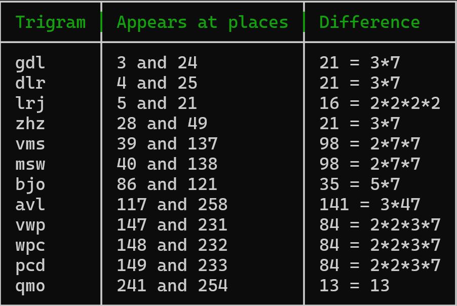
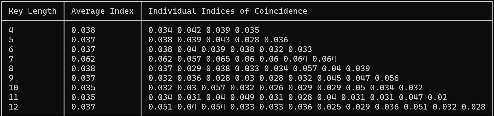
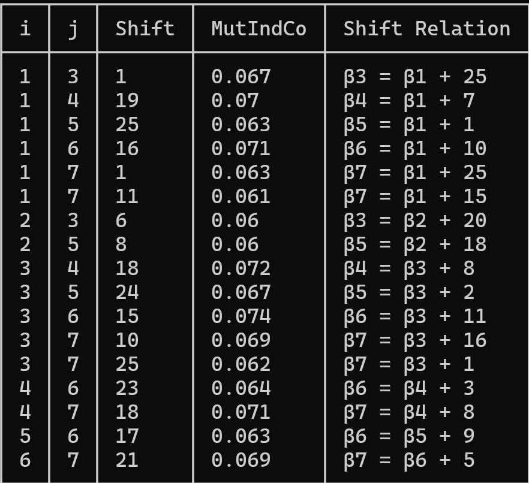

# Description
This code apply the KASISKI Attack to break Vigenere Cipher by finding the keyword.
You can find explanations of kasiski attack here : https://en.wikipedia.org/wiki/Kasiski_examination

# Installation
```
git clone https://github.com/D0pp3lgang3r/VigAnalyser.git
cd VigAnalyser
python3 Kasiski.py
```

# Example
Extracted from "An Introduction To Mathematical Cryptography"
Let ciphertext be : `zpgdlrjlajkpylxzpyyglrjgdlrzhzqyjzqrepvmswrzyrigzhzvregkwivssaoltnliuwoldieaqewfiiykhbjowrhdogcqhkwajyaggemisrzqoqhoavlkbjofrylvpsrtgiuavmswlzgmsevwpcdmjsvjqbrnklpcfiowhvkxjbjpmfkrqthtkozrgqihbmqsbivdardymqmpbunivxmtzwqvgefjhucborvwpcdxuwftqmoowjipdsfluqmoeavljgqealrktiwvextvkrrgxani`
The tool will first analyse trigrams and get their positions to calculate differences :
<p align="center">
  
</p>
As we can see most of the differences are divisible by 7 so our keylength is probably 7. Then to be sure of the keylength we can calculate the Index of Coincidence of each substring built from the ciphertext, here is the result by keylength:
<p align="center">
  
</p>
From the above picture 7 is the right keylength because the average for that keylength is close to 0.068, finally we get thoses equations : 
<p align="center">
  
</p>
No you can choose the exact value of β1, by trying only 26 possibilities it will give you the correct keyword cause of the relations. 
